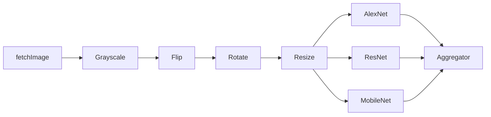

# XFaaS Workflow for Image Classification 



### Introduction

This README file provides a brief overview and step-by-step guide for image classificarion using the XFaaS workflow. This workflow aims to convert image to grayscale, flip,rotate, and classify the image using Alexnet, Resnet, CNN.


### Function Descriptions

#### fetchImage -
This function fetches the image from the S3 bucket and returns the image data in base64 encoded format.
#### rgb2Gray -
In this step,The fetched image is converted to grayscale.

#### flip -
In this step,The fetched image is flipped.
#### rotate -
In this step,The fetched image is rotated.

### fetchModels-
In this step, the models are fetched from the S3 bucket and stored in the /dependencies directory and encoded in base64 format.

#### alexnet-
In this step, the image is classified using alexnet model.

#### resnet-
In this step, the image is classified using resnet model.

#### cnn-
In this step, the image is classified using cnn model.

### aggregator-
In this step, the results from the previous 3 steps are aggregated and the final result is returned.


### Request body

```json
{
    "input_bucket" : "xfaas-workloads-sprint",
    "input_key" : "sanjai-testimage.jpg",
    "modelbucket":"xfaas-workloads-sprint",
    "resnetmodelkey":"resnet1",
    "alexnetmodelkey":"alexnet_pretrained.pth",
    "cnnmodelkey":"Squeezenet.sav"

}


```


### Response 
```json
{
    "message": "Success",
    "result": {
        "body": {
            "Predictions": [
                {
                    "model": "cnn",
                    "prediction": "196, miniature_schnauzer"
                },
                {
                    "model": "resnet",
                    "prediction": "toy_poodle"
                },
                {
                    "model": "alexnet",
                    "prediction": "283, Persian_cat"
                }
            ]
        },
        "metadata": null,
        "statusCode": 200
    },
    "statusCode": 200
}
```


## Authors

- [@sanjaibalajee](https://www.github.com/sanjaibalajee)
- [@Yashasvee2003](https://www.github.com/Yashasvee2003)


